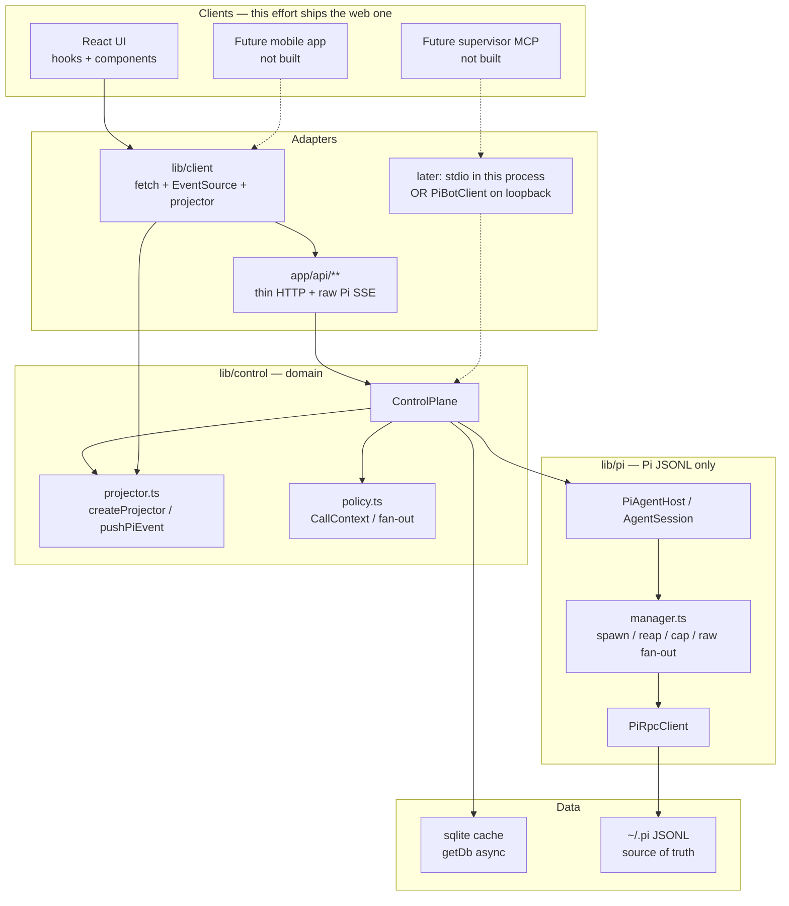
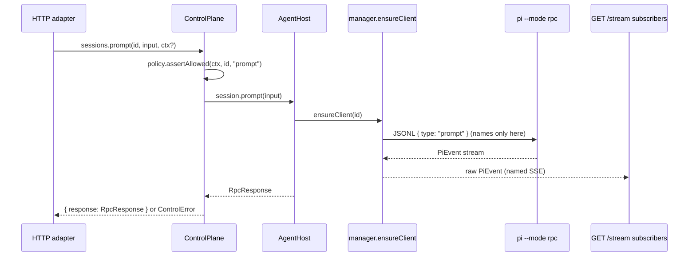
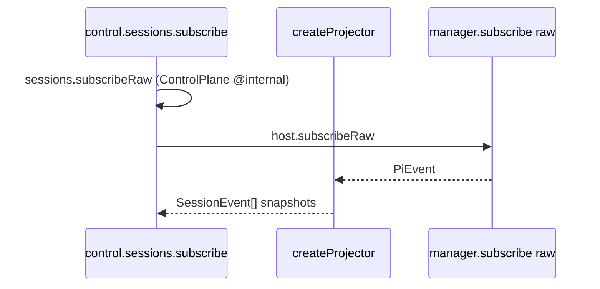

# Control plane vs UI decoupling for PiBot

| Field | Value |
| ----- | ----- |
| Status | Draft |
| Date | 2026-09-20 |
| Author | (design; not yet implemented) |
| Product | PiBot 0.1.0 (tested against pi 0.85.x) |
| Scope | Same git repo. No new package, no new deployable, no mobile app. |
| Audience | Maintainers who already know `lib/pi/manager.ts`, `hooks/usePiSession.ts`, and `AGENTS.md` |
| Revision | 4 — fan-out listen-before-`prompt()` (same-chunk `agent_settled`); drop stale review issue numbers |

---

## Overview

PiBot is a single-user Bun + Next.js web GUI that drives `pi --mode rpc` over JSONL. Today the React UI, Next route handlers, process manager, and Pi protocol types are one tangle: `app/api/sessions/**` call `ensureClient` and send `{ type: "prompt" }`, and `hooks/usePiSession.ts` switches on Pi event names (`agent_start`, `message_update` / `text_delta`, `tool_execution_*`, …) to assemble a streaming draft.

This document extracts an in-process **control plane** (`lib/control/`) that owns session/process/RPC/event logic, a **Pi transport** (`lib/pi/`) that is the only layer allowed to speak JSONL command names, a **thin HTTP/SSE adapter** (existing `app/api/**` URLs and payloads frozen), and a **browser TypeScript client** (`lib/client/`) that the React app — and a future mobile app — import. A later MCP adapter for “an agent managing other agents” is a thin wrapper over the same control plane; it is designed here and not built now.

The extraction is a strangler: characterization tests lock current HTTP/SSE behavior, then logic moves behind those routes one PR at a time. The running web app must not change behavior. TDD is required on every PR.

---

## Background & Motivation

### What exists today

Request path, from `docs/PROJECT.md`:

```
Browser  ── fetch + EventSource ──▶  Next.js API routes
                                          │
                     ┌────────────────────┼────────────────────┐
                     ▼                    ▼                    ▼
              SQLite cache         PiRpcClient            request-guard
              (sessions,           (Bun.spawn             (Host / CSRF /
               messages,            pi --mode rpc)         optional token)
               settings)
                                          │
                                          ▼
                                   pi JSONL session file
                                   (source of truth)
```

One web session = one `pi` subprocess in that session’s `cwd`. Spawn is lazy on **user intent** (`POST /api/sessions/[id]/start` from composer focus). Viewing a session must not spawn. Idle reap (default 15 min) and a soft process cap (default 10) spare busy sessions; reap nulls `entry.client` but keeps the managed entry and SSE emitter.

There is **no `AgentClient` interface**. `PiRpcClient` (`lib/pi/rpc-client.ts`) is the only client. `lib/pi/manager.ts` is simultaneously process supervisor, SSE fan-out, and message-cache writer.

### Pain

1. **UI is a Pi RPC console.** `usePiSession` hard-codes `EVENT_TYPES` (named SSE; `EventSource.onmessage` never fires for those) and a delta assembler for `text_delta` / `thinking_delta` / `toolcall_*`. `Composer` knows `steer` / `follow_up`. `ToolCallCard` special-cases Pi tool names `read` / `write` / `edit` / `bash`. A mobile app would copy all of this.

2. **Routes are the API.** Session CRUD, prompt, abort, bash, files, and process inventory live in Next handlers that import `ensureClient` / `getLiveClient` / `subscribe` directly (e.g. `app/api/sessions/[id]/prompt/route.ts`, `app/api/sessions/[id]/stream/route.ts`). There is no way to list sessions or prompt one without thinking about HTTP.

3. **A supervisor agent cannot call in-process.** To have a Pi session manage other sessions, the only door today is the same HTTP API, which is a browser CSRF/Host-allowlist boundary, not an agent tool surface. Wrapping HTTP in MCP would duplicate auth, envelopes, and Pi event assembly. Wrapping a control plane is one function per tool.

4. **Dead / leaky endpoints prove the mixing.** `GET /api/sessions/[id]/tree` and `GET /api/models` have no UI callers but spawn pi. `GET /api/sessions/[id]/model` spawns, so opening the model picker wakes a sleeping session — a documented contradiction of the lazy-spawn invariant (`docs/PROJECT.md` §7). ChatView `onOpen={() => s.loadModels()}` is the leak.

### Why now, and why this shape

The product request is not “build a framework.” It is: **same repo, same app, same threat model, make the agent-management layer callable without React**, so a second *client* (mobile, supervisor MCP) does not rewrite core. That is an extraction, not a rewrite.

---

## Goals & Non-Goals

### Goals

1. A typed, in-process control plane that can list/create/start/prompt/abort/compact sessions, read transcripts, browse session files, and inspect processes **without importing React or Next**.
2. Pi JSONL command names confined to `lib/pi/` (`host.ts`). `PiEvent` inner delta names (`text_delta`, …) confined to `lib/pi/types.ts` plus the projector that consumes them.
3. Existing web app stays green: same URLs, `{ ok, data }` envelopes, **per-route HTTP statuses**, named SSE events, lazy spawn (including known leaks), request-guard, Docker, hydration rules.
4. A small TypeScript client (fetch + EventSource today) that covers **every call the current UI makes**, so a future mobile app is not blocked by a half-SDK.
5. A designed (not implemented) supervisor-agent surface: MCP is a thin wrapper later; recursion/fan-out policy is specified and wired to method signatures.
6. TDD on every PR: failing test first, characterization tests before moves, existing suite stays green.
7. Stay in this git project. Reorganize modules; do not publish an npm package or split a deployable.

### Non-goals (this effort)

- A mobile app, a new repo, a published package, or a second deployable.
- Multi-user auth, accounts, or per-session ACLs. The supervisor has the **same power as the local user**.
- Replacing SSE with WebSockets, or churning URLs to `/api/v1` without a compatibility reason.
- Rewriting the visual design, adding session URLs, importing orphan `~/.pi` JSONL files, or fixing unrelated product gaps in `docs/PROJECT.md` except where an extraction naturally touches them.
- A generic multi-agent framework (Claude Code, Aider, …). The transport is Pi. A second *client* does not require a second *agent protocol*.
- Fully implementing the supervisor agent or shipping an MCP server in the first PRs.
- Changing bind defaults, Docker topology, or `tini` as PID 1.
- “Fixing” `GET /model` spawn, the `client_exit` toast copy, or `persistMessages` transactions.

---

## Key Decisions

1. **Same repo, three layers: `lib/pi` (transport) → `lib/control` (domain) → `app/api` + `lib/client` (adapters).** No workspace package, no `packages/`. Path alias `@/*` stays. Rationale: the runtime is one Bun process; splitting a package would force versioning and dual builds for no isolation benefit.

2. **Hybrid of (A) and (B): domain operations + projected live events; Pi-shaped transcript DTOs.** Control-plane methods are `prompt` / `abort` / `compact`, not `{ type: "prompt" }`. Live updates are a small `SessionEvent` set. Settled messages stay `AgentMessage` (roles `user` / `assistant` / `toolResult` / `bashExecution`, assistant blocks `text` / `thinking` / `toolCall`) because that *is* the product’s transcript and the sqlite cache. Fully normalizing messages into a generic block model would be a second-agent framework; we are not building that.

3. **One projector API, two call sites, no third copy.** `createProjector()` + `pushPiEvent(p, wireEvent) → SessionEvent[]`. Each `SessionEvent` is a **snapshot** (full `StreamingDraft`, accumulated bash text). `applySessionEvent` **replaces** fields; it never concatenates. Owners: (a) `lib/control/subscribe.ts` for in-process subscribers, (b) `lib/client/stream.ts` for HTTP EventSource. The HTTP SSE **adapter does not project** — `/stream` still emits raw `PiEvent`. There is **no** `SessionView` on the managed entry; idle reap does not touch projector state because projector state lives in each subscriber. The dual-assembler window is closed in **PR 3** by making `usePiSession` call `pushPiEvent` while it still owns EventSource.

4. **HTTP/SSE is a compatibility adapter, not the API.** First PRs freeze current URLs, JSON envelopes, **and per-route status codes** (including **500** for “Session not found” on `ensureClient` paths). Named SSE events remain Pi-shaped on the wire. No `/api/v1`. Do not invent a shrunk `RpcResult`; HTTP `data.response` is today’s `RpcResponse` (`id?`, `type: "response"`, `command`, `success`, `error?`, `data?`). Create and pin keep `ok(..., { status: 201 })` in the HTTP adapter.

5. **`AgentHost` exposes domain methods; JSONL command names live only in `lib/pi/host.ts`.** Control never constructs `RpcCommand`. `AgentSession` has first-class `prompt` / `abort` / `compact` / `bash` / **`newSession` / `switchSession` / `fork` / `clone`**. `sendRaw` exists solely for the `POST /control` catch-all (`SessionService.control()`). `get` / `getMessages` / `getStats` / `rename` use **`getLive` only**, never `ensure`. Cache sync is `host.syncIfLive(id)` (no-op when asleep) plus manager’s existing `agent_settled` persist. `syncMessagesFromPi` must not be called from those read paths (it `ensureClient`s today). The HTTP SSE adapter calls **`control.sessions.subscribeRaw`** (`@internal`, no projector, no spawn) — never `lib/pi/host`.

6. **Supervisor = local user.** Allowed MCP deployments later: **(a)** stdio **in the same OS process** as `bun run start` (imports `control`, no bind), or **(b)** a **separate** process that is a `PiBotClient` against `http://127.0.0.1` with `Cookie: pibot_token=...`. Never import `createControlPlane` in a second OS process (that is a second `globalThis.__pibotManaged`). **No internal MCP HTTP route.** No new listener. No `proxy.ts` exception. Recursion/fan-out via `CallContext` on mutating methods.

7. **Strangler + characterization tests. No big-bang file move.** PR 1 is a concrete checklist of tests (see the PR Plan table), not a slogan. `lib/pi/types.ts` may re-export domain types during the transition; the re-export is deleted once UI imports the client/types barrels.

8. **No schema change.** Pi JSONL remains source of truth; sqlite remains a cache. `getDb()` stays async. `persistMessages` stays delete-then-insert until a dedicated cache PR.

9. **Import fences via ESLint core `no-restricted-imports` + a grep test.** Do not add `eslint-plugin-import`. `lib/pi/manager.ts` and `host.ts` may `import type` from `lib/control/types` only. UI must not import `PiRpcClient` or manager.

10. **Lazy-spawn contract is unchanged, including known leaks.** Read paths that today do not spawn still must not. `GET /model`, `GET /tree`, `GET /api/models` **do** spawn; PR 1 locks that so wrapping them with `getLiveClient` cannot silently “fix” the leak.

---

## Current coupling (verified)

| Layer | Files | How it is coupled |
| ----- | ----- | ----------------- |
| Pi types | `lib/pi/types.ts` | RPC + transcript + `STREAMING_MESSAGE_ID` + `RunningProcessInfo` in one module. UI and tests import this. |
| Transport | `lib/pi/rpc-client.ts` | `Bun.spawn`, LF framing, `send` / `writeRaw`, `env: { ...process.env }`. |
| Manager | `lib/pi/manager.ts` | `ensureClient`, `getLiveClient`, `subscribe`, `broadcast`, `stopProcess`, `sweepIdleClients`, `persistMessages`, `ensureGlobalClient`. State on `globalThis`. `syncMessagesFromPi` always `ensureClient`. |
| HTTP | `app/api/sessions/**`, `app/api/processes/**`, `app/api/projects/**`, `app/api/models`, `app/api/health` | Call manager + send Pi command `type`s. Envelope via `lib/api.ts` (`ok` / `fail` / `readJson`). |
| React hook | `hooks/usePiSession.ts` | Hard-coded `EVENT_TYPES` (25 names), delta assembler, REST refresh side effects, 8s stats poll, `POST /start` on `ensureProcess`. |
| Chat chrome | `components/ChatView.tsx`, `Composer.tsx`, `Overlays.tsx`, `ToolCallCard.tsx`, `AppShell.tsx` | Direct `api('/api/sessions/...')`; process poll every 5s; Pi roles and tool names; ChatView retries failed **direct** prompts with `streamingBehavior: "steer"`; ModelPicker `onOpen` → `GET /model`. |
| Browser fetch | `lib/client-api.ts` | Generic `{ ok, data }` helper. Also holds `SessionListItem` / `ProjectListItem` (duplicates of proposed control types). |
| Security | `lib/request-guard.ts` + `proxy.ts` | Host allowlist, same-origin CSRF, optional HttpOnly `PIBOT_TOKEN`. Must stay the HTTP boundary. |
| Raw files | `lib/file-browser.ts` `rawFileUrl` | Always `/api/sessions/${id}/files/raw?path=…` — locked by `test/file-browser-ui.test.ts`. Must stay a same-origin URL for ``. |
| HTML export | `lib/export-html.ts` | `export_html` stages `/tmp/pibot-export-<id>.html` (pi would default to the session cwd); the browser downloads `exportDownloadUrl(id)` from `GET /api/sessions/[id]/export`. Naming is shared by the control plane and the UI. |

Spawn vs no-spawn (must not regress; **extend** `test/lazy-spawn.test.ts` so leaks are locked too):

| Path | Spawns? | Tested today? |
| ---- | ------- | ------------- |
| `GET /api/sessions`, `GET /api/sessions/[id]`, `/messages`, `/stats`, SSE `/stream` | No | Yes (`lazy-spawn.test.ts`) |
| Read-only `POST /control` (`get_commands`, `get_fork_messages`, `get_last_assistant_text`) | No if asleep | Yes |
| `GET /api/sessions/[id]/export` (staged HTML export download) | No | Yes (`http-contract/export-download.test.ts`) |
| `POST /api/sessions/[id]/start` | Yes | Yes |
| `POST /prompt`, `/bash`, mutating `/control`, `/lifecycle`, `/model` POST | Yes | Manager tests, not HTTP 409 |
| `GET /api/sessions/[id]/model` | **Yes** (known leak; ChatView picker `onOpen`) | **No — PR 1 must add** |
| `GET /api/sessions/[id]/tree`, `GET /api/models` | **Yes**, no UI callers | **No — PR 1 must add** |

There is **no** prompt-409 test, **no** named-SSE client listener test (`composer-intent`’s `FakeEventSource.addEventListener` is a no-op), and **no** lifecycle clone test (`fake-pi.ts` `default:` succeeds unknown commands without changing `sessionFile`, so a naive clone test is false-green).

---

## Proposed Design

### Target architecture



HTTP prompt (wire unchanged). Projector is **not** on this path:



In-process subscribe (MCP / tests) **does** project:



### Module layout (exact)

```
lib/
  control/                 # domain — no Next, no React, no PiRpcClient
    types.ts               # isomorphic DTOs (AgentMessage, SessionEvent, …)
    errors.ts              # ControlError { status, code } — status is per-call, not inferred
    projector.ts           # isomorphic: createProjector / pushPiEvent / applySessionEvent
    policy.ts              # CallContext, self-prompt / fan-out counter
    sessions.ts            # CRUD + get/list/rename/delete
    runtime.ts             # start, prompt, abort, compact, bash, model, lifecycle, dialogs
    processes.ts           # list + stop + limits
    projects.ts            # pin / unpin / list + folder picker
    files.ts               # mentions, browse, text preview, raw bytes
    health.ts              # SERVER ONLY: Bun.$ pi --version; do not import from client
    subscribe.ts           # subscribeRaw (PR 6, no projector) + projected subscribe (PR 14)
    plane.ts               # ControlPlane facade + createControlPlane()
    index.ts               # SERVER barrel (do not import from client components)
  pi/                      # transport — JSONL command names live only here
    types.ts               # RpcCommand, RpcResponse, PiEvent; temporary domain re-exports
    rpc-client.ts          # unchanged contract
    manager.ts             # process lifetime, raw subscribe, persistMessages
    host.ts                # NEW: AgentHost + AgentSession domain methods → JSONL
    env.ts                 # PI_BINARY, idle timeout, cap
    process-state.ts       # deprecate: re-export from control/types during transition
  client/                  # isomorphic UI SDK — no bun:sqlite, no Bun.spawn, no health.ts
    index.ts
    http.ts                # today’s lib/client-api.ts (credentials + optional token)
    sse-names.ts           # PI_SSE_EVENT_TYPES (the 25 named events)
    pibot.ts               # PiBotClient 1:1 with current UI calls
    stream.ts              # EventSource + named-event registration + projector
  api.ts                   # stays: NextResponse ok/fail/readJson (HTTP adapter only)
  request-guard.ts         # stays: HTTP security boundary
  db/, files.ts, file-browser.ts, file-mentions.ts, emitter.ts, runtime.ts, net.ts, …
app/api/**                 # thin: parse params → control → ok/fail; SSE uses control.sessions.subscribeRaw
hooks/                     # React; after PR 16, EventSource lives in lib/client
components/                # React; domain types from lib/control/types or lib/client
```

**What moves vs stays**

| Stays put | Moves into `lib/control` (logic) | New |
| --------- | -------------------------------- | --- |
| `lib/pi/rpc-client.ts`, `manager.ts`, `env.ts` | Session CRUD currently in `app/api/sessions/route.ts` and `[id]/route.ts` | `lib/control/**` |
| `lib/db/**`, `lib/files.ts`, `lib/file-browser.ts` (pure helpers, including `rawFileUrl`) | Prompt/control/bash/model/lifecycle/extension-ui/start/tree | `lib/pi/host.ts` |
| `lib/request-guard.ts`, `proxy.ts` | Processes, projects, files, health | `lib/client/**` |
| `lib/file-mentions.ts`, `lib/slash-commands.ts` (composer UX) | `assistantText` / `messagePreview` / `streamingAssistantMessage` from `lib/pi/types.ts` | eslint core fences |
| `components/**`, visual design | `sessionProcessStates` (pure) | `test/control/**`, `test/http-contract/**` |
| Docker, `scripts/next.ts`, `test/helpers/fake-pi.ts` | — | — |

`lib/client-api.ts` is absorbed by `lib/client/http.ts` and becomes a one-line re-export until callers migrate.

`lib/pi/types.ts` becomes transport-only (`RpcCommand`, `RpcResponse`, `PiEvent`) plus **temporary re-exports** of domain types. The re-export is removed in the import-fence PR.

Do **not** copy the stale comment in `app/api/sessions/route.ts` that says spawn happens on “open/prompt/stream.” Composer-focus `POST /start` is the wake-up.

### Import rules (enforced)

| From | Allowed | Forbidden |
| ---- | ------- | --------- |
| `components/**`, `hooks/**`, `app/page.tsx`, `app/layout.tsx` | `@/lib/client/**`, `@/lib/control/types`, `@/lib/control/projector`, `@/lib/file-browser`, `@/lib/file-mentions`, UI libs | `@/lib/control` (server barrel), `@/lib/control/health`, `@/lib/pi/manager`, `@/lib/pi/rpc-client`, `@/lib/pi/host`, `@/lib/pi/env`, `@/lib/db` |
| `app/api/**` | `@/lib/control`, `@/lib/api` | `@/lib/pi/manager`, `@/lib/pi/rpc-client`, `@/lib/pi/host` (never, once the matching extract PR lands — SSE uses `control.sessions.subscribeRaw`, not the host) |
| `lib/client/**` | `@/lib/control/types`, `@/lib/control/projector`, `@/lib/file-browser` (`rawFileUrl`) | `bun:*`, `Bun.spawn`, `@/lib/db`, `@/lib/pi/manager`, `@/lib/pi/rpc-client`, `@/lib/control/health`, `next/server` |
| `lib/control/types.ts`, `lib/control/projector.ts` | `@/lib/pi/types` (`PiEvent` / `RpcResponse` as types) | `bun:*`, `next/*`, `react`, `@/lib/pi/manager` |
| `lib/control/**` except types/projector | `@/lib/pi/host`, `@/lib/db`, `@/lib/files`, `@/lib/file-browser` (DTO types + `fileKind`), `@/lib/file-mentions` (`MentionEntry`), `@/lib/pi/env` | `next/*`, `react`, `@/app/**`, `@/lib/pi/rpc-client` |
| `lib/pi/manager.ts`, `lib/pi/host.ts` | `@/lib/pi/*`, **`import type` only** from `@/lib/control/types` | `@/lib/control` barrel, `next/*`, `react` |
| `test/manager.test.ts`, `test/rpc-client.test.ts` | `lib/pi` directly | — |
| `test/control/**` | `lib/control` + fake-pi via host | Hitting `./data/pibot.db` |

**Fences (no new eslint plugin):** `eslint.config.mjs` uses **core** `no-restricted-imports` with `files` globs (the plugin is not in `package.json` and must not be added unless we need transitives). `test/import-fences.test.ts` greps `components/`, `hooks/`, `app/` (except `app/api` during the strangler), `lib/client/**`, `lib/control/types.ts`, `lib/control/projector.ts` for `ensureClient`, `PiRpcClient`, `bun:`, `Bun.spawn`, `next/server`.

**Barrel trap:** `lib/control/index.ts` must not be imported from client components, or Next will bundle `bun:sqlite`. Client code imports `@/lib/control/types` and `@/lib/control/projector` only. `health.ts` uses `Bun.$` — server-only; the SDK calls `GET /api/health`.

---

## Control-plane public API

The facade is a plain object created by `createControlPlane(deps?)`. Next routes and tests use the default singleton (state still lives in `globalThis` inside the manager — the plane does not grow a second process table).

```ts
// lib/control/plane.ts
export interface ControlPlane {
  sessions: SessionService;
  processes: ProcessService;
  projects: ProjectService;
  health: HealthService;
}

export function createControlPlane(deps?: Partial<ControlDeps>): ControlPlane;
/** Process-wide default. Next routes call this. */
export const control: ControlPlane;
```

Errors are thrown, never returned as `{ ok: false }` — that envelope is HTTP-only.

```ts
// lib/control/errors.ts
export type ControlCode =
  | "not_found"
  | "bad_request"
  | "conflict"      // prompt 409 (busy regex, or any steer/follow_up failure)
  | "internal"
  | "forbidden";    // policy (self-prompt, cycle)

export class ControlError extends Error {
  readonly status: 400 | 403 | 404 | 409 | 500;
  readonly code: ControlCode;
  readonly extra?: Record<string, unknown>;
  constructor(
    code: ControlCode,
    message: string,
    opts: { status: 400 | 403 | 404 | 409 | 500; extra?: Record<string, unknown> },
  );
}
```

**`status` is explicit at the throw site.** Do not infer `not_found → 404`. Today:

| Path | “Session not found” / missing row | Notes |
| ---- | --------------------------------- | ----- |
| `GET /sessions/[id]`, `GET /stream`, file routes | **404** (route checks sqlite first) | |
| `PATCH /sessions/[id]` | **404** if no row | |
| `DELETE /sessions/[id]` | **200** `{ deleted: id }` even if no row (`destroyClient` no-ops) | keep |
| `POST /start`, `/prompt`, `/bash`, `/model`, `/lifecycle`, `/extension-ui`, mutating `/control`, `GET /model`, `GET /tree` | **500** — `ensureClient` throws `new Error("Session not found")` and the route’s `catch` uses 500 | **do not “fix” to 404** |
| `POST /prompt` empty body | **400** “Message is required” (before ensure) | |
| `POST /prompt` `mode === "steer"` or `"follow_up"` and `!res.success` | **409** always | |
| `POST /prompt` default mode `!res.success` | **409** iff `/streaming\|already\|busy\|queue/i`, else **400** | |
| `POST /sessions` create, `POST /projects` pin | **201** | set in HTTP adapter, not in control |

`mapControlError(err)`: if `ControlError`, `fail(message, err.status, extra)`; else `fail(toErrorMessage(err), 500)` — same as today’s generic catch.

Do **not** invent `RpcResult`. HTTP `data.response` is `RpcResponse` from `lib/pi/types.ts` (re-exported as a type from control). `control("export_html")` stages the transcript at `exportTempPath(id)` and returns `data.path`; ChatView ignores the path (it knows `exportDownloadUrl(id)`) and hands it to the browser.

### CallContext (on mutating methods now)

```ts
export type CallSource = "ui" | "supervisor" | "system";

export interface CallContext {
  source: CallSource;
  /** Session that issued the call, when source === "supervisor". */
  fromSessionId?: string;
  /** Stack of session ids already in this prompt chain. */
  chain: string[];
}

export const UI_CTX: CallContext = { source: "ui", chain: [] };
```

Every mutating `SessionService` / `ProcessService` method takes `ctx: CallContext = UI_CTX` as the **last** argument. HTTP adapters omit it (default UI). MCP later passes supervisor ctx. `source: "ui"` is allow-all (policy no-op) so extract PRs cannot change the web app. See [Supervisor-agent surface](#supervisor-agent-surface-design-now-implement-later) for fan-out.

### SessionService

Signatures match **current HTTP `data` payloads** so routes stay `return ok(await control.sessions.…)`. Comments note spawn behavior.

```ts
export interface SessionRecord {
  id: string;
  name: string;
  cwd: string;
  provider: string | null;
  modelId: string | null;
  thinkingLevel: string | null;
  piSessionId: string | null;
  piSessionFile: string | null;
  createdAt: number;
  updatedAt: number;
}

export interface SessionListItem extends SessionRecord {
  preview: string | null;
  messageCount: number;
}

export interface CreateSessionInput {
  name?: string;
  cwd?: string;
  provider?: string;
  model?: string;
  thinkingLevel?: string;
}

/** Wire values for POST /prompt `mode`. ChatView's UI value `"direct"` means omit `mode` (server defaults to `"prompt"`). Never send `mode: "direct"`. */
export type PromptMode = "prompt" | "steer" | "follow_up";

export interface PromptInput {
  message?: string;
  images?: Array<{ type: "image"; data: string; mimeType: string }>;
  mode?: PromptMode; // omit for a normal prompt
  streamingBehavior?: "steer" | "followUp";
}

export interface SessionService {
  list(): Promise<{ sessions: SessionListItem[] }>;
  create(input: CreateSessionInput, ctx?: CallContext): Promise<{ session: SessionRecord }>;
  get(id: string): Promise<{
    session: SessionRecord;
    state: SessionState | null;
    stats: SessionStats | null;
    messages: AgentMessage[];
    liveError: string | null;
    live: boolean;
  }>; // never spawns; 404 if no row
  rename(id: string, name: string, ctx?: CallContext): Promise<{ session: SessionRecord }>; // getLive only
  delete(id: string, ctx?: CallContext): Promise<{ deleted: string }>; // always 200

  start(id: string, ctx?: CallContext): Promise<{ started: boolean; live: boolean }>; // ensure; missing → 500

  getMessages(id: string): Promise<{
    messages: AgentMessage[];
    live: boolean;
    liveError?: string;
  }>; // getLive / cache only; never ensure
  getStats(id: string): Promise<{
    state: SessionState | null;
    stats: SessionStats | null;
    live: boolean;
    stateError?: string | null;
    statsError?: string | null;
  }>; // getLive only; never ensure

  prompt(id: string, input: PromptInput, ctx?: CallContext): Promise<{ response: RpcResponse }>;
  abort(id: string, ctx?: CallContext): Promise<{ response: RpcResponse }>; // timeout 60s
  compact(id: string, opts?: { customInstructions?: string }, ctx?: CallContext): Promise<{ response: RpcResponse }>; // 300s
  bash(id: string, command: string, ctx?: CallContext): Promise<{ result: unknown }>; // id `bash-${Date.now()}`, 300s
  abortBash(id: string, ctx?: CallContext): Promise<{ response: RpcResponse }>;

  getModel(id: string, ctx?: CallContext): Promise<{
    models: PiModel[];
    state: unknown;
    thinkingLevels: string[] | null;
  }>; // TODAY spawns — do not change
  setModel(id: string, input: { provider?: string; modelId: string; level?: string }, ctx?: CallContext): Promise<{
    response: RpcResponse;
    model?: unknown;
  }>;
  setThinkingLevel(id: string, level: string, ctx?: CallContext): Promise<{ response: RpcResponse }>;
  // POST /model { level } without modelId — ChatView thinking picker

  /**
   * Catch-all matching POST /control. This is the Pi-protocol escape hatch
   * and the **only** ControlPlane caller of `AgentSession.sendRaw`.
   * Read-only actions (get_commands, get_fork_messages, get_last_assistant_text)
   * return { response: null, live: false } without spawning.
   * `action: "abort" | "compact"` **delegates** to `SessionService.abort` /
   * `compact` (same host methods + `syncIfLive`) so ChatView `client.sessions.abort()`
   * cannot drift from POST `/control`. Other mutating actions spread
   * `{ type: action, ...body, action: undefined }` via `sendRaw` (parity appendix).
   */
  control(id: string, body: { action: string } & Record<string, unknown>, ctx?: CallContext): Promise<{
    response: RpcResponse | null;
    live?: boolean;
  }>;

  /**
   * Maps `op` → `AgentSession.newSession` / `switchSession` / `fork` / `clone`.
   * Owns the sqlite clone dance. Never constructs `RpcCommand`.
   */
  lifecycle(id: string, body: { op: "new_session" | "switch_session" | "fork" | "clone" } & Record<string, unknown>, ctx?: CallContext): Promise<{
    response: RpcResponse;
    clonedSession?: SessionRecord;
  }>;

  answerDialog(id: string, body: {
    id: string;
    value?: string;
    confirmed?: boolean;
    cancelled?: boolean;
  }, ctx?: CallContext): Promise<{ sent: true }>;

  getTree(id: string, ctx?: CallContext): Promise<{ tree: unknown }>; // spawns; unused by UI

  /**
   * In-process projected events. Does not spawn. Each subscriber has its own projector.
   * Implemented in PR 14 as `subscribeRaw` + `createProjector`.
   */
  subscribe(id: string, listener: (ev: SessionEvent) => void): Unsubscribe;

  /**
   * `@internal` raw PiEvent fan-out. Does **not** project, does **not** spawn
   * (same placeholder emitter as `manager.subscribe` today).
   * Lands in **PR 6**. Production caller: `app/api/sessions/[id]/stream/route.ts` only.
   * Policy fan-out (PR 19) may also attach a one-shot listener here.
   * React / PiBotClient must not call this — they use `subscribe` or HTTP EventSource.
   */
  subscribeRaw(id: string, listener: (ev: PiEvent) => void): Unsubscribe;

  files: FileService;
}

export type Unsubscribe = () => void;
```

`FileService` wraps `lib/files.ts` + DTO types from `lib/file-browser.ts` / `lib/file-mentions.ts`. It does not reimplement listings.

```ts
import type { BrowseEntry, FilePreviewData } from "@/lib/file-browser";
import type { MentionEntry } from "@/lib/file-mentions";

export interface FileService {
  listMentions(sessionId: string, dir: string): Promise<{ cwd: string; dir: string; entries: MentionEntry[] }>;
  browse(sessionId: string, dir: string): Promise<{
    cwd: string; dir: string; entries: BrowseEntry[]; truncated: boolean;
  }>;
  preview(sessionId: string, relPath: string): Promise<FilePreviewData>;
  raw(sessionId: string, relPath: string, opts?: { download?: boolean }): Promise<RawFile>;
}

export interface RawFile {
  absPath: string; // HTTP adapter does Bun.file(abs). NEVER JSON this to the browser.
  name: string;
  size: number;
  contentType: string;
  download: boolean;
}
```

Path jail stays `resolveWithinRoot` in `lib/files.ts`.

### ProcessService / ProjectService / HealthService

```ts
export interface ProcessService {
  list(): Promise<{ processes: RunningProcessInfo[]; limits: ProcessLimits }>;
  stop(sessionId: string | null, opts?: { force?: boolean }, ctx?: CallContext): Promise<{ stopped: boolean }>;
}

export interface ProjectService {
  list(): Promise<{ projects: ProjectInfo[] }>;
  pin(path: string, ctx?: CallContext): Promise<{ project: ProjectInfo | null }>; // HTTP 201
  unpin(path: string, ctx?: CallContext): Promise<{ projects: ProjectInfo[] }>;
  /** Full-filesystem listing. Same power as GET /api/projects/folders. Root-equivalent. */
  listFolders(path: string): Promise<{
    path: string; parent: string | null; entries: Array<{ name: string; path: string }>;
  }>;
}

export interface HealthService {
  get(): Promise<{
    app: "PiBot";
    piBinary: string;
    piVersion: string | null;
    piAvailable: boolean;
    defaultCwd: string;
    runtime: string; // `bun ${Bun.version}`
  }>;
  listGlobalModels(): Promise<{ models: unknown[] }>; // GET /api/models; spawns global client
}
```

---

## Projector (single API)

There is **no** server-owned `SessionView` on the managed entry. Reap/stop keep the SSE emitter (raw `PiEvent`); each subscriber accumulates independently.

```ts
// lib/control/projector.ts
export interface StreamingDraft {
  text: string;
  thinking: string;
  toolCalls: Array<{ id: string; name: string; argsText: string }>;
  usage: Record<string, number> | null;
}

export interface SessionView {
  streaming: boolean;
  compacting: boolean;
  draft: StreamingDraft;
  toolLive: Record<string, { name: string; text: string }>;
  bashLive: Record<string, string>;
  queue: { steering: string[]; followUp: string[] };
  dialogs: DialogRequest[];
}

/** Wire event: PiEvent or the SSE adapter's synthetic `{ type: "ready", sessionId, ts }`. */
export type WireEvent = { type: string; [k: string]: unknown };

export interface Projector {
  readonly view: SessionView;
}

export function emptySessionView(): SessionView;
export function createProjector(): Projector;

/**
 * Fold one wire event into projector.view; return the SessionEvents to emit.
 * SessionEvents are snapshots: draft.updated.draft is the full StreamingDraft;
 * bash.updated.text is the accumulated string so far.
 */
export function pushPiEvent(p: Projector, ev: WireEvent): SessionEvent[];

/**
 * Apply a snapshot SessionEvent to a view. REPLACE fields; never concatenate
 * draft.text or bashLive[id]. Used by React / MCP to fold events they receive.
 */
export function applySessionEvent(view: SessionView, ev: SessionEvent): SessionView;
```

`DialogRequest` is the subset of today’s `ExtensionUiRequest` that the UI renders as modals (`select` / `confirm` / `input` / `editor`). `setStatus` / `setWidget` / `setTitle` / `set_editor_text` remain ignored (product gap #5).

### SessionEvent (snapshots)

```ts
export type SessionEvent =
  | { type: "session.ready"; sessionId: string; ts: number }
  | { type: "turn.started" }
  | { type: "turn.ended" }
  | { type: "turn.settled"; durationMs?: number }
  | { type: "draft.cleared" }
  | { type: "draft.updated"; draft: StreamingDraft }
  | { type: "tool.started"; toolCallId: string; name: string }
  | { type: "tool.updated"; toolCallId: string; name: string; text: string }
  | { type: "tool.ended"; toolCallId: string }
  | { type: "bash.updated"; id: string; text: string } // accumulated snapshot, not delta
  | { type: "queue.updated"; steering: string[]; followUp: string[] }
  | { type: "compaction.started" }
  | { type: "compaction.ended" }
  | { type: "retry.started"; attempt: string }
  | { type: "retry.ended"; success: boolean; error?: string }
  | { type: "dialog.requested"; dialog: DialogRequest }
  | { type: "notify"; kind: "info" | "warning" | "error"; message: string }
  | { type: "process.exited"; reason?: string; info?: unknown }
  | { type: "extension.error"; error: string };
```

**Toasts:** the projector emits **typed events only**, except `notify` which is solely `extension_ui_request` with `method === "notify"`. It does **not** also emit `notify` for compaction/retry/client_exit. The React hook maps typed events to `pushToast` (see [React session runtime](#react-session-runtime-not-the-projector)). Never both.

### PiEvent → SessionEvent mapping

This table is the spec. Implement as `test/control/projector.test.ts`. Inner `+=` happens **inside** `pushPiEvent` on `p.view`; the emitted event carries the result.

| Pi `ev.type` (and inner) | SessionEvent(s) | `p.view` after `pushPiEvent` |
| ------------------------ | --------------- | ---------------------------- |
| SSE `ready` | `session.ready` | unchanged |
| `agent_start` | `turn.started` | `streaming = true` |
| `agent_settled` | `turn.settled` (`durationMs` when the manager measured the run) | `streaming = false`, draft = empty |
| `agent_end` / `turn_end` / `message_end` | `turn.ended` (no `source` field) | unchanged (REST refresh is the hook; every `turn.ended` is equivalent — see runtime table) |
| `message_start` (assistant) | `draft.cleared` | draft = empty |
| `message_update` / `text_delta` | `draft.updated` { full draft } | `draft.text += delta` internally |
| `message_update` / `thinking_delta` | `draft.updated` | `draft.thinking += delta` internally |
| `message_update` / `toolcall_start` | `draft.updated` | push toolCalls row |
| `message_update` / `toolcall_delta` | `draft.updated` | last `argsText += delta` internally |
| `message_update` / `toolcall_end` | `draft.updated` | replace row from `toolCall` |
| `message_update` / `text_start` or `text_end` or unknown inner | `draft.updated` **if** `usage` present, else **no event** | still apply `usage` onto draft when present; do **not** drop the wire event on the floor without considering usage (today’s hook) |
| `tool_execution_start` | `tool.started` | `toolLive[id] = { name, text: "" }` |
| `tool_execution_update` | `tool.updated` { full text } | `toolLive[id].text = joined partial` (replace; Pi sends the partial snapshot) |
| `tool_execution_end` | `tool.ended` | delete `toolLive[id]` |
| `bash_execution_update` | `bash.updated` { **accumulated** `text` } | `bashLive[id] += String(ev.delta ?? "")` internally, then emit that string. Test: two deltas `"a"`, `"b"` → one view with `"ab"`, and `applySessionEvent` of those two events also yields `"ab"` (replace), **not** `"aabb"` |
| `queue_update` | `queue.updated` | replace queue |
| `compaction_start` | `compaction.started` only (no `notify`) | `compacting = true` |
| `compaction_end` | `compaction.ended` | `compacting = false` |
| `auto_retry_start` | `retry.started` only | unchanged |
| `auto_retry_end` | `retry.ended` | unchanged |
| `extension_ui_request` select/confirm/input/editor | `dialog.requested` | append if new id |
| `extension_ui_request` notify | `notify` | unchanged |
| other extension_ui methods | none | unchanged |
| `extension_error` | `extension.error` | unchanged |
| `client_exit` | `process.exited` | `streaming = false` |
| `turn_start`, `summarization_retry_*`, unnamed `message` | none | still **registered** on the HTTP EventSource name list so the browser does not drop them |

`streamingAssistantMessage(content)` remains how a view turns `SessionView.draft` into an `AgentMessage` with `id: STREAMING_MESSAGE_ID` so `messageKey` in `components/MessageList.tsx` does not remount per token (`test/streaming-steps.test.ts`).

### Who runs the projector

| Site | Runs projector? |
| ---- | --------------- |
| `app/api/sessions/[id]/stream/route.ts` | **No.** Calls `control.sessions.subscribeRaw`; forwards raw `PiEvent` as named SSE. |
| `lib/control/subscribe.ts` | **Yes.** One `createProjector()` per `subscribe()` call. |
| `lib/client/stream.ts` | **Yes.** One projector per `PiBotClient.sessions.subscribe()`. |
| `hooks/usePiSession.ts` after PR 3, before PR 16 | **Yes**, via `pushPiEvent` in the existing EventSource effect (closes dual-assembler). Still owns `EVENT_TYPES` until PR 16. |
| Manager / `PiRpcClient` | **No.** |

### EventSource reconnect

The browser’s `EventSource` auto-reconnects on the **same** object; `ready` fires again. Today React state **keeps** the draft across reconnect; REST refresh is the reconcile. Spec: one `Projector` per `subscribe()` / hook effect. Do **not** call `createProjector()` on `session.ready`. Session-id change (effect re-run) creates a new projector and clears React state the way `loadSession` already does.

---

## React session runtime (not the projector)

`SessionView` is not the whole hook. The following side effects stay in React (or later in a small `session-runtime.ts` helper used only by the hook). They are **not** `SessionEvent`s. PR 3 and PR 16 must keep them; freeze with tests.

### REST refresh

**Choice (frozen for PR 3):** do **not** add `source` on `turn.ended`. Today `agent_end` also calls `refreshStats()` immediately while `turn_end` / `message_end` only `scheduleRefresh()`. After the projector those three Pi events are the same `SessionEvent`. Distinguishing them would leak Pi names back into the domain type. The extra stats fetch is snappier-only (debounced `scheduleRefresh` already coalesces the triple; the 8s streaming poll and `turn.settled` still refresh stats). Freeze the simpler rule:

| SessionEvent | Action |
| ------------ | ------ |
| `turn.settled` | `refreshMessages()` + `refreshStats()` **immediately** |
| `tool.ended` | `scheduleRefresh()` (450ms debounce) — **mid-turn `toolResult` rows** |
| `turn.ended` (any of `agent_end` / `turn_end` / `message_end`) | `scheduleRefresh()` **only** — no extra immediate `refreshStats` |
| `compaction.ended` | `refreshMessages()` + `refreshStats()` immediately |

Without settle / `tool.ended` refresh, the transcript stalls until settle and tool cards have no results mid-turn. Dropping the extra `agent_end` stats fetch is an accepted, unobservable-in-practice freeze (not a product change to chase in an extract).

### Toasts (hook maps typed events; projector does not emit duplicate `notify`)

| SessionEvent | `pushToast` |
| ------------ | ----------- |
| `compaction.started` | `info`, `"Compacting context…"` |
| `retry.started` | `warning`, `Retrying after transient error (attempt ${attempt})…` |
| `retry.ended` with `success !== true` | `error`, `Retry failed: ${error}` |
| `notify` | kind + message from event |
| `extension.error` | `error`, `Extension error: ${error}` |
| `process.exited` | `error`, `"Pi process exited. Reload the session to respawn it."` — **keep the wrong copy** (gap #12; do not fix in extract) |

### Other hook state (not in SessionView)

- `connected`: `session.ready` → true; EventSource `readyState === CLOSED` → false.
- `hasProcess`: from REST `live` flags and `start()`.
- Stats poll every **8s while `streaming`**.
- `ensureProcess` / `start()` success also `loadCommands()` + `loadModels()` (slash palette / model picker).
- `GET /model` on ModelPicker `onOpen` still **spawns** (`s.loadModels()`).
- `streamingAssistantMessage` + `STREAMING_MESSAGE_ID` for the visible row.

### ChatView (not the hook)

- UI queue mode `"direct"` → POST body **omits** `mode` (server defaults `"prompt"`). `"steer"` / `"follow_up"` set `mode`.
- If a **direct** prompt fails (`!r.ok`), retry once with `{ ...payload, streamingBehavior: "steer" }`. Then `refreshMessages()` after 800ms regardless. Characterization test in PR 1; keep in ChatView through PR 17.

---

## PiAgentHost (transport interface)

JSONL command names are written **only** in `lib/pi/host.ts`. Control talks domain methods.

```ts
// lib/pi/host.ts
export interface AgentHost {
  ensure(id: string): Promise<AgentSession>;
  getLive(id: string): AgentSession | null;
  subscribeRaw(id: string, fn: (ev: PiEvent) => void): Unsubscribe;
  destroy(id: string): void;
  listRunning(): Promise<RunningProcessInfo[]>;
  stop(id: string | null, opts?: { force?: boolean }): boolean;
  processLimits(): ProcessLimits;
  ensureGlobal(): Promise<AgentSession>;
  /** Persist get_messages through the live client. Returns null if asleep — never ensure. */
  syncIfLive(id: string): Promise<AgentMessage[] | null>;
  readCachedMessages(id: string): Promise<AgentMessage[]>;
}

export interface AgentSession {
  readonly alive: boolean;
  readonly pid: number | null;
  prompt(input: PromptInput): Promise<RpcResponse>; // maps omitted/prompt → prompt; steer; follow_up
  abort(): Promise<RpcResponse>;                    // timeoutMs 60_000
  compact(opts?: { customInstructions?: string }): Promise<RpcResponse>; // 300_000
  bash(command: string): Promise<RpcResponse>;      // { type: "bash", id: `bash-${Date.now()}`, command }, 300_000
  abortBash(): Promise<RpcResponse>;
  getState(): Promise<RpcResponse>;
  getSessionStats(): Promise<RpcResponse>;
  getMessages(): Promise<RpcResponse>;
  getAvailableModels(): Promise<RpcResponse>;
  getAvailableThinkingLevels(): Promise<RpcResponse>;
  setModel(input: { provider?: string; modelId: string }): Promise<RpcResponse>;
  setThinkingLevel(level: string): Promise<RpcResponse>;
  setSessionName(name: string): Promise<RpcResponse>;
  getTree(): Promise<RpcResponse>;
  newSession(opts?: { parentSession?: string }): Promise<RpcResponse>;
  switchSession(sessionPath: string): Promise<RpcResponse>;
  fork(entryId: string): Promise<RpcResponse>;
  clone(): Promise<RpcResponse>;
  writeExtensionUi(payload: Record<string, unknown>): void; // writeRaw; adds type: "extension_ui_response"
  /**
   * Catch-all for `SessionService.control()` only.
   * Control `prompt` / `abort` / `compact` / `bash` / `lifecycle` must not use this.
   */
  sendRaw(cmd: RpcCommand, opts?: { timeoutMs?: number }): Promise<RpcResponse>;
}

export function createPiAgentHost(): AgentHost;
```

`ControlDeps`:

```ts
export interface ControlDeps {
  host: AgentHost;
  db: () => Promise<BunSQLiteDatabase<typeof schema>>;
  now: () => number;
  policy?: PolicyEngine;
}
```

`get` / `getMessages` / `getStats` / `rename`:

```
const live = host.getLive(id);
if (live) { /* getState / getSessionStats / host.syncIfLive */ }
else { /* cache / nulls / live: false */ }
```

Never `host.ensure` on those paths. `syncIfLive` uses the live `AgentSession.getMessages()` + manager `persistMessages`, not `syncMessagesFromPi`.

Tests of policy inject a fake `AgentHost`. Spawn/reap tests still use real manager + `fake-pi.ts`.

---

## HTTP/SSE adapter

### Compatibility (this effort)

Keep, byte-for-behavior:

- URLs under `app/api/**` (no `/api/v1`).
- JSON `{ ok: true, data }` / `{ ok: false, error }` via existing `lib/api.ts`.
- `readJson` still parses any body (CSRF load-bearing).
- Named SSE: `event: ${ev.type}\ndata: ${JSON.stringify(ev)}\n\n` plus `: ping` heartbeats every 25s. **Raw PiEvent, no projector.**
- `runtime = "nodejs"`, `dynamic = "force-dynamic"`, `await params`.
- File `raw` headers: `X-Content-Type-Options: nosniff`, `Content-Security-Policy: default-src 'none'; sandbox`, never `text/html` / script types.
- `ok(data, { status: 201 })` for `POST /api/sessions` and `POST /api/projects`.

```ts
export async function POST(req: Request, { params }: Params) {
  const { id } = await params;
  try {
    const body = await readJson<PromptInput>(req);
    return ok(await control.sessions.prompt(id, body)); // default ctx = UI
  } catch (err) {
    return mapControlError(err);
  }
}
```

Busy regex and steer/follow_up 409 live in `sessions.prompt`, not the route.

SSE (PR 6+): the route imports **`control`**, never `lib/pi/host` / `manager`:

```ts
const off = control.sessions.subscribeRaw(id, (ev) => send(ev.type ?? "message", ev));
```

`sessions.subscribeRaw` is `@internal` on ControlPlane: wraps `host.subscribeRaw`, does **not** project, does **not** spawn. The HTTP stream route is the only production caller. After the client SDK lands, the React hook must not call it (it uses EventSource → projector, then `client.sessions.subscribe`).

### Optional later `/api/v1`

Not in this effort. If a non-TS client appears: old URLs keep working; new stream may emit `event: session.event`.

### Dead endpoints

Keep `GET /tree` and `GET /api/models` in the control plane for a supervisor. Do not delete as cleanup.

---

## Client SDK for UIs

`PiBotClient` is **1:1 with the current UI’s HTTP calls**, not a subset of ControlPlane. Control returns HTTP `data` shapes (`{ sessions }`). The client **unwraps** where that is what the UI wants (`list(): Promise<SessionListItem[]>`). Specify unwrap vs envelope at each method so `ok.data` cannot drift.

```ts
export interface PiBotClientOptions {
  /** Default "". Same-origin in the web app. */
  baseUrl?: string;
  fetch?: typeof fetch;
  EventSource?: typeof EventSource;
  /**
   * If set, every fetch sends `Cookie: pibot_token=<token>`.
   * The web app leaves this unset: `PIBOT_TOKEN` is HttpOnly (`TOKEN_COOKIE`),
   * minted by GET/HEAD `/?token=`, and the browser attaches it.
   * Loopback agents (MCP option b) must pass `token`.
   */
  token?: string;
  /** Default "include" so same-origin EventSource/fetch send the HttpOnly cookie. */
  credentials?: RequestCredentials;
}

export class PiBotClient {
  constructor(opts?: PiBotClientOptions);

  health: { get(): Promise<HealthSnapshot> };

  sessions: {
    list(): Promise<SessionListItem[]>;                    // unwrap data.sessions
    create(input: CreateSessionInput): Promise<SessionRecord>;
    get(id: string): Promise<SessionDetail>;               // full data blob
    rename(id: string, name: string): Promise<SessionRecord>;
    delete(id: string): Promise<void>;
    start(id: string): Promise<{ started: boolean; live: boolean }>;
    messages(id: string): Promise<{ messages: AgentMessage[]; live: boolean; liveError?: string }>;
    stats(id: string): Promise<StatsSnapshot>;
    prompt(id: string, input: PromptInput): Promise<{ response: RpcResponse }>;
    abort(id: string): Promise<{ response: RpcResponse }>;
    compact(id: string, opts?: { customInstructions?: string }): Promise<{ response: RpcResponse }>;
    clearQueue(id: string): Promise<unknown>;
    exportHtml(id: string): Promise<unknown>;
    control(id: string, body: { action: string } & Record<string, unknown>): Promise<{ response: RpcResponse | null; live?: boolean }>;
    bash(id: string, command: string): Promise<{ result: unknown }>;
    abortBash(id: string): Promise<{ response: RpcResponse }>;
    getModel(id: string): Promise<{ models: PiModel[]; state: unknown; thinkingLevels: string[] | null }>;
    setModel(id: string, input: { provider?: string; modelId: string; level?: string }): Promise<unknown>;
    setThinkingLevel(id: string, level: string): Promise<unknown>;
    lifecycle(id: string, body: { op: string } & Record<string, unknown>): Promise<{ response: RpcResponse; clonedSession?: SessionRecord }>;
    answerDialog(id: string, body: DialogAnswer): Promise<void>;
    getTree(id: string): Promise<{ tree: unknown }>;
    subscribe(id: string, listener: (ev: SessionEvent) => void): Unsubscribe;
  };

  processes: {
    list(): Promise<{ processes: RunningProcessInfo[]; limits: ProcessLimits }>;
    stop(id: string | null, opts?: { force?: boolean }): Promise<{ stopped: boolean }>;
  };

  projects: {
    list(): Promise<ProjectInfo[]>;
    pin(path: string): Promise<ProjectInfo | null>;
    unpin(path: string): Promise<ProjectInfo[]>;
    listFolders(path: string): Promise<FolderListing>;
  };

  files: {
    mentions(sessionId: string, dir: string): Promise<{ cwd: string; dir: string; entries: MentionEntry[] }>;
    browse(sessionId: string, dir: string): Promise<{ cwd: string; dir: string; entries: BrowseEntry[]; truncated: boolean }>;
    preview(sessionId: string, path: string): Promise<FilePreviewData>;
    /** Same helper as today — still an /api URL for . */
    rawUrl(sessionId: string, path: string, opts?: { download?: boolean }): string;
  };
}
```

`files.rawUrl` **is** `rawFileUrl` from `lib/file-browser.ts`. `` stays a same-origin `/api/sessions/.../files/raw?...` path. PR 16–17 must **not** turn thumbnails into authenticated `fetch` blobs. Locked by `test/file-browser-ui.test.ts`.

`sessions.subscribe` (`lib/client/stream.ts`):

1. `new EventSource(url, { withCredentials: true } as never)` when the runtime supports it; web same-origin already sends cookies.
2. Register `addEventListener` for **`PI_SSE_EVENT_TYPES`** (exported snapshot of today’s 25 names). Also `onmessage` fallback.
3. If `opts.token` is set, EventSource **cannot** set `Cookie`. Document: native/loopback clients must use a polyfill that injects the cookie, or hit `GET ${baseUrl}/?token=` once so the jar has `pibot_token`. This effort does not ship that polyfill; the options object is not a dead end.
4. `JSON.parse` → `pushPiEvent` → each `SessionEvent` to `listener`.
5. Unsubscribe removes per-name listeners and `es.close()`.

A future RN app is **not** a drop-in until token + EventSource polyfill exist. “Not built now” is fine.

Default singleton: `export const pibot = new PiBotClient()` for the web app (`credentials: "include"`, no token).

After PR 16 the hook must not mention `text_delta` or inline `EVENT_TYPES`. After PR 17, components must not hard-code `/api/sessions/` **except** `rawFileUrl`.

---

## Supervisor-agent surface (design now, implement later)

### Allowed deployments (exhaustive)

**(a) stdio in the same OS process as `bun run start`.** Imports `control`. No bind. Process-local ⇒ **bypasses Host/CSRF** — acceptable only because the caller is already on the machine (same as today’s route modules). When it lands, `SECURITY.md` must say: stdio MCP is root-equivalent and must not be exposed over TCP.

**(b) Separate OS process that is a `PiBotClient` against `http://127.0.0.1` with `Cookie: pibot_token=...`.** Uses the existing HTTP door (`proxy.ts`). EventSource cookie: see client options.

**Forbidden:**

- Importing `createControlPlane` / `lib/pi/manager` in a **second** OS process (second `__pibotManaged` → double spawn).
- An “internal” `app/api/mcp` (or similar) route. That is a second HTTP surface. If someone skips CSRF “because it is for agents,” that is the weaker door `SECURITY.md` exists to prevent.
- A new TCP/Unix listener, a `proxy.ts` matcher exception, a second port.

### Authz (explicit)

**The supervisor has the same power as the local user.** No per-session ACL. `bash`, folder picker (full filesystem), `files.*`, stop, delete — all allowed. Document in `SECURITY.md` when MCP lands, including that **files and `projects.listFolders` are root-equivalent**.

### Recursion and fan-out

```ts
export const DEFAULT_SUPERVISOR_FANOUT = 3;

export function assertAllowed(
  ctx: CallContext,
  targetSessionId: string,
  kind: "prompt" | "bash" | "lifecycle",
): void;
```

Rules:

1. `source === "ui"` or `"system"` → return (today’s app).
2. Self-prompt: `fromSessionId === targetSessionId` → `ControlError forbidden` (403).
3. Cycle: `targetSessionId ∈ ctx.chain` → 403 `forbidden`.
4. Fan-out (**prompts only**, `kind === "prompt"`): **per `fromSessionId`**, counter in the **policy module** (not a second process table). Fourth concurrent in-flight prompt from the same supervisor session → `ControlError conflict` status **409**. Env `PIBOT_SUPERVISOR_FANOUT` when MCP lands (default 3).

**Once per increment, listen before send.** One turn emits `message_end` + `turn_end` + `agent_end` + `agent_settled`. Decrementing on each would go negative. Registering the listener **after** `await session.prompt()` is also wrong in this repo: `PiRpcClient.onStdoutChunk` parses every line in the chunk synchronously — a `type: "response"` `pending.resolve` continues the loop and following event lines `emit("event")` **before** the `await prompt()` continuation runs. Default fake-pi (`burstAsync` with `FAKE_PI_SLOW_TURN_MS` unset) writes the RPC response then `agent_start` … `agent_settled` in the same burst. A post-await listener **misses settle and leaks the slot**.

`source === "ui"` skips the whole block. For supervisor prompts, **this order is mandatory** (implementers must not invert subscribe and `await prompt`):

```
assertAllowed(ctx, id, "prompt")     // reads counter; 409 if already at cap; does not increment
session = await this.host.ensure(id) // plane instance, not global `control`

let released = false
let off = () => {}
const release = () => {
  if (released) return
  released = true
  decrement(fromSessionId)
  off()
}

off = this.sessions.subscribeRaw(id, (ev) => {   // THIS plane, not global control.sessions
  if (ev.type === "agent_settled" || ev.type === "client_exit") release()
})
increment(fromSessionId)                         // after listener is attached, before send

try {
  res = await session.prompt(input)              // may emit agent_settled in the same stdout chunk
  if (!res.success) {
    release()                                    // slot never meant to stay held
    // map ControlError as today (409/400)
  }
  // success: if settle already ran during await, release() already ran (idempotent).
  // if the turn is still open, slot stays until first settle/exit.
} catch (e) {
  release()
  throw e
}
```

`release()` runs **at most once** (settled-during-await, later settle, `client_exit`, `!success`, or throw). Do **not** decrement on `turn.ended` / `message_end` / `turn_end` / `agent_end`. Do not attach via a process-global `control` singleton — policy tests inject `createControlPlane({ host: fake })` and must use `this.subscribeRaw`.

Mutating methods call `assertAllowed` **now** (no-op for UI ctx). PR 19 depends on **PR 6 + PR 7** (`subscribeRaw` + `prompt`), not only PR 5.

Do **not** nest RPC on the same JSONL stdin. Cross-session only.

### MCP tool list

**Explicit subset** of ControlPlane, not a false “1:1” that omits files:

Always: `sessions.list|get|create|rename|delete|start|messages|stats|prompt|abort|compact|bash|abortBash|getModel|setModel|control|lifecycle|answerDialog|getTree|subscribe`, `processes.list|stop`, `projects.list`, `health.get`.

Call out as **root-equivalent, include only with a SECURITY.md sentence**: `files.browse|preview|mentions`, `projects.pin|unpin|listFolders`.

Streaming: in-process `subscribe` (deployment a) or poll messages+stats (deployment b). Do not stream raw Pi deltas to the supervisor. **Do not** invent snapshot-on-subscribe in the MCP PR; that stays [Open Question 5](#open-questions) and needs a test when a consumer appears.

---

## Data Model Changes

**None for this effort.**

`persistMessages` stays delete-then-insert (gap #8). SSE replay sequence numbers are gap #23.

---

## Alternatives Considered

### 1. Pure (A): control plane exposes Pi DTOs and command names

Thin wrap: `control.send(id, { type: "prompt", message })`, SSE is `PiEvent`. Fastest extract.

**Trade-off:** every client reimplements `usePiSession`. MCP tools become `send_raw_rpc`. Fails the “future UIs without rewriting core” goal. Rejected as the *public* API; retained as `AgentSession.sendRaw` for the control catch-all only.

### 2. Pure (B): fully generic multi-agent session model

**Trade-off:** large design, no second agent, high risk of breaking 0.85.x quirks (`writeRaw`, 409 regex, clone dance). Rejected.

### 3. New package / new repo (`@pibot/control`)

**Trade-off:** versioning, dual CI, contradicts “stay in this git project.” ESLint core fences give the boundary. Rejected.

### 4. Replace SSE with WebSockets / a custom Node server

**Trade-off:** Next 16 cannot hold WS without a custom server; Docker/launcher change; out of scope.

### 5. Big-bang move `lib/pi` → `lib/control` in one PR

**Trade-off:** review hell, spawn/SSE regressions. Strangler is slower and safer.

### 6. Supervisor talks only HTTP

Simplest later adapter. **Trade-off:** named SSE + projector + cookie. Kept as **deployment (b)** only, not as the in-process design.

### 7. Server-owned SessionView on the managed entry

Would make drafts survive subscriber reconnect without REST. **Trade-off:** idle reap / `stopProcess` must define what happens to that view; two sources of truth vs sqlite cache. Rejected for this effort; projector is per-subscriber.

---

## Security & Privacy Considerations

Threat model **unchanged** (`SECURITY.md`, `lib/request-guard.ts`):

- Single-user, no login. Anything that can reach the port is a shell.
- Default bind `127.0.0.1`.
- Host allowlist; same-origin for non-GET (including `no-cors` + `text/plain`).
- Optional HttpOnly `PIBOT_TOKEN`. Query `?token=` works on GET/HEAD only (redirect + Set-Cookie).
- Native clients with **no** `Origin` are allowed today (`evaluateRequestGuard` only denies when Origin mismatches or `sec-fetch-site` is cross-site). Fine for loopback; the SDK still sends the cookie when `token` is set.
- Folder picker lists the whole filesystem by design.
- File raw responses CSP-sandboxed; path jail via `resolveWithinRoot`.

**Control plane is as dangerous as today’s API.**

Rules:

1. Do not inline security in routes or in `lib/control`. HTTP still goes through `proxy.ts`.
2. Do not add a second network listener or an MCP HTTP route.
3. `lib/control` is process-local.
4. MCP: stdio same-process **or** loopback `PiBotClient` + token. Never a second manager. Update `SECURITY.md` (stdio bypasses CSRF; files/folder-picker are root-equivalent).
5. Do not log prompt bodies or file contents.
6. `test/proxy.test.ts` and `test/request-guard.test.ts` stay green. Cross-site `POST` `Content-Type: text/plain` + `Origin: https://evil.example` → 403.

---

## Observability

Keep `console.log` in manager (`[pi] reaped`, …). Add `[control] prompt session=<id> mode=steer` without message text. No OpenTelemetry.

Process inventory remains a 5s poll from AppShell (gap #20 — out of scope).

---

## Rollout Plan

No feature flags. **Each merged PR is the rollout.** Rollback is `git revert`.

Order:

1. Characterization tests (lock wire **and** spawn leaks).
2. Types + re-exports.
3. **Projector + hook calls `pushPiEvent`** (closes dual assembler). EventSource / `EVENT_TYPES` still in the hook.
4. `AgentHost` domain methods; no route changes.
5. Control behind routes, split by surface (CRUD → start/read/stream → prompt → control/ui → bash/model/tree → lifecycle → processes → projects → files/health).
6. In-process subscribe; then `PiBotClient`; then hook EventSource migration; then remaining chrome.
7. Import fences last.
8. Policy tests against `ctx` (signatures already present).

Docker/`tini`/bind untouched. `test/hydration.test.ts` on every PR that touches `AppShell` / hooks. Client SDK must not read `window` at module init.

---

## Risks

| Risk | Severity | Mitigation |
| ---- | -------- | ---------- |
| Viewing a session starts spawning | High | Extended `lazy-spawn` including `GET /model`, `/tree`, `/api/models` |
| Named SSE listeners dropped | High | `PI_SSE_EVENT_TYPES` snapshot test; FakeEventSource must record `addEventListener` |
| Dual assembler drift | High | PR 3 puts projector under the hook immediately |
| Browser bundle imports `bun:sqlite` | High | types/projector split; health.ts server-only; grep fences |
| HTTP status “cleanup” (ensure 500 → 404; steer fail → 400) | High | Characterization per-route; `ControlError.status` explicit |
| Clone dance false-green | Medium | Extend fake-pi **before** the clone test |
| `react-dom/client` static import | High | `test/helpers/dom.ts`; `dom-bootstrap.test.ts` |
| Second process manager via MCP | High | Forbidden in this doc; deployment a or b only |
| Policy blocks UI | Medium | Default `UI_CTX` no-op; tests |
| `rawFileUrl` rewritten to fetch | Medium | `test/file-browser-ui.test.ts`; client `files.rawUrl` wraps existing helper |
| Projector `+=` plus `applySessionEvent` `+=` doubles bash | High | Snapshot events + replace apply; explicit two-delta test |

---

## Open Questions

1. **When (if ever) to dual-emit projected events on SSE.** Default: not in this effort.
2. **MCP deployment a vs b at implementation time.** Both are allowed; pick then. Not an open architecture question.
3. **Tighten `GET /model` spawn leak.** Out of this effort. Same for reaping the global metadata process (gap #10).
4. **Fan-out default (3).** Becomes `PIBOT_SUPERVISOR_FANOUT` when MCP lands.
5. **Should `subscribe()` deliver a snapshot `SessionView` on attach?** Deferred. Web client REST-loads messages. **MCP must not invent this silently** — needs a failing test when a consumer wants it.

---

## Parity appendix

Mechanical behaviors implementers would otherwise rediscover. Freeze in characterization tests where noted.

| Item | Spec |
| ---- | ---- |
| `abort` timeout | `60_000` (`control/route.ts`) |
| `compact` timeout | `300_000` |
| `bash` timeout | `300_000` |
| `bash` RPC id | `` `bash-${Date.now()}` `` |
| `POST /control` mutating body | `abort`/`compact` delegate to host methods; others `{ type: action, ...body, action: undefined }` via `sendRaw` only from `SessionService.control()` |
| `lifecycle` ops | `AgentSession.newSession` / `switchSession` / `fork` / `clone` — never `sendRaw` |
| SSE attach | `control.sessions.subscribeRaw` (no projector, no spawn); route does not import host |
| `POST /control` read-only asleep | `{ response: null, live: false }`, no spawn |
| Live `GET /sessions/[id]` | `get_state` + `get_session_stats` + sync messages; writes `piSessionId` / `piSessionFile` / `thinkingLevel` back onto the sqlite row |
| `message_update` `text_start` / `text_end` | fake-pi emits them; apply `usage` if present; unknown inner types do not throw |
| EventSource reconnect | same projector; `ready` again; keep draft; REST reconciles |
| Create comment | do not copy “spawn on open/prompt/stream” into control |
| Health | `runtime: \`bun ${Bun.version}\``; `Bun.$`${piBinary()} --version``; **not** imported by `lib/client` |
| ChatView `"direct"` | omit `mode` on the wire |
| Prompt 409 | steer/follow_up: any `!success` → 409; prompt: busy regex → 409 else 400 |
| Missing session on ensure-paths | **500**, not 404 |
| Create / pin | HTTP **201** in the adapter |
| `DELETE` missing session | **200** `{ deleted: id }` |
| `rawFileUrl` | `/api/sessions/${id}/files/raw?path=` |

---

## References

- `docs/PROJECT.md` — briefing, spawn table, shortcomings.
- `AGENTS.md` / `Claude.md` — Bun-only, TDD, SSE named events, hydration, `getDb()` async.
- `SECURITY.md` — threat model.
- `lib/pi/manager.ts` — `ensureClient` (throws `"Session not found"`), `subscribe` placeholder, `syncMessagesFromPi` always ensures, `persistMessages`.
- `lib/pi/rpc-client.ts` — JSONL framing, `writeRaw`, `env: { ...process.env }`.
- `hooks/usePiSession.ts` — `EVENT_TYPES` (25 names), delta assembler, REST refresh, 8s poll.
- `components/ChatView.tsx` — steer retry; `onOpen` → `loadModels`.
- `app/api/sessions/[id]/prompt/route.ts` — 409 mapping.
- `app/api/sessions/[id]/lifecycle/route.ts` — clone dance.
- `lib/file-browser.ts` — `BrowseEntry`, `FilePreviewData`, `rawFileUrl`.
- `lib/request-guard.ts`, `proxy.ts`, `test/proxy.test.ts`.
- `test/lazy-spawn.test.ts`, `test/manager.test.ts`, `test/composer-intent.test.ts`, `test/streaming-steps.test.ts`, `test/hydration.test.ts`, `test/file-browser-ui.test.ts`.
- `test/helpers/fake-pi.ts` — unknown commands succeed; clone must be added before clone tests.

---

## PR Plan

Each PR is independently reviewable and mergeable. Red-green-refactor. `bun test` (including `hydration.test.ts`) + `bunx tsc --noEmit` + `bun run lint` + `bun run build`. No spawn-policy “fixes.” Style for HTTP tests: import `GET`/`POST` from `app/api/**/route.ts` + `installFakePi()` + `freshDb()`, same as `test/lazy-spawn.test.ts` / `test/file-browse.test.ts`. Never `./data/pibot.db`, never real `pi`, never `npx next dev`.

Shared ritual: failing test first; if the PR only relocates logic, characterization from PR 1 plus “this route file no longer imports `ensureClient`.”

---

### PR 1 — HTTP/SSE characterization (lock the wire)

**Title:** `test: lock session HTTP, spawn leaks, prompt 409, and SSE names`

**Depends on:** nothing

**Files (tests only, except exporting nothing yet):**

| Test file | Assert |
| --------- | ------ |
| extend `test/lazy-spawn.test.ts` | `GET /api/sessions/[id]/model`, `GET .../tree`, `GET /api/models` **do** spawn (`getLiveClient` non-null / process list contains the session or global client). Viewing paths still do **not**. |
| `test/http-contract/prompt.test.ts` | empty body → 400; default prompt busy-regex → 409; other prompt fail → 400; steer `!success` → 409; follow_up `!success` → 409; missing session on prompt → **500**; success `{ ok: true, data: { response } }` where `response.type === "response"` |
| `test/http-contract/stream.test.ts` | `Content-Type: text/event-stream`; first chunk contains `event: ready`; heartbeat comment; subscribe does not spawn |
| `test/client/sse-names.test.ts` | grep/snapshot today’s `EVENT_TYPES` array in `usePiSession.ts` — the 25 strings `ready` … `client_exit` … `message`. Later PRs import `PI_SSE_EVENT_TYPES` and this test switches to equality. |
| `test/chat-prompt-retry.test.ts` | ChatView: failed direct prompt retries with `streamingBehavior: "steer"` (happy-dom + stub fetch; none exists today) |
| `test/http-contract/create-pin-status.test.ts` | `POST /api/sessions` and `POST /api/projects` return **201** |

**Clone is not in PR 1.** Current fake-pi would false-green. Clone waits for PR 10’s fake-pi extension.

**TDD:** write tests describing **current** behavior; they should pass against main (characterization) except ChatView retry / 409 if we must extend fake-pi to fail busy — extend fake-pi **in this PR** with a command or env knob that makes `prompt` return `success: false, error: "agent is busy"` without changing production. Steer-fail: similar knob.

**App stays green:** tests + fake-pi knobs only.

---

### PR 2 — Domain types extract + temporary re-exports

**Title:** `refactor: move transcript DTOs to lib/control/types`

**Depends on:** PR 1 preferred

**Files:** `lib/control/types.ts`, `lib/control/errors.ts`, `lib/pi/types.ts` (re-export), `test/control/errors.test.ts`, `test/message-helpers.test.ts`.

**Description:** Move `AgentMessage`, `SessionState`, `SessionStats`, `PiModel`, `RunningProcessInfo`, `ProcessLimits`, `ExtensionUiRequest`, `STREAMING_MESSAGE_ID`, `streamingAssistantMessage`, `assistantText`, `messagePreview`. `ControlError` requires **explicit `status`** — unit test: `not_found` can be 404 **or** 500 depending on opts; there is no default map.

**TDD:** errors test fails; implement; re-export so existing `@/lib/pi/types` imports compile.

**App stays green:** tsc.

---

### PR 3 — Projector + hook uses `pushPiEvent` (close dual assembler)

**Title:** `feat: SessionEvent projector; usePiSession folds Pi events through it`

**Depends on:** PR 2

**Files:** `lib/control/projector.ts`, `lib/client/sse-names.ts` (`PI_SSE_EVENT_TYPES` copied from the hook), `hooks/usePiSession.ts` (replace the switch body with `pushPiEvent` + `applySessionEvent` + the [React session runtime](#react-session-runtime-not-the-projector) table), `test/control/projector.test.ts`, `test/client/sse-names.test.ts` (now imports the exported list), `test/streaming-steps.test.ts`, `test/hydration.test.ts`, `test/composer-intent.test.ts`.

**Description:** Hook still owns EventSource and registers `PI_SSE_EVENT_TYPES`. It must not contain `text_delta` concatenation. REST refresh follows the frozen table: `turn.ended` → `scheduleRefresh()` only (no extra `refreshStats` from former `agent_end`). Toasts, 8s poll, `loadModels`/`loadCommands` after start stay. `client_exit` copy stays.

**TDD:**

1. Projector tests (text/thinking/toolcall, bash two-delta no double-concat, usage on `text_start`, dialog vs notify, compaction does **not** emit `notify`). Fail.
2. Implement projector.
3. Hook test: dispatch named `message_update` / `text_delta` via a FakeEventSource that **records** `addEventListener` (fix the no-op fake first — failing test).
4. Wire hook to `pushPiEvent`. Hydration + streaming-steps green.

**App stays green:** live UI behavior identical; one assembler.

---

### PR 4 — AgentHost with domain methods (no route changes)

**Title:** `feat: PiAgentHost domain methods over manager`

**Depends on:** PR 2

**Files:** `lib/pi/host.ts`, `test/pi/host.test.ts`. Manager unchanged except host calling it.

**Description:** `ensure` / `getLive` / `subscribeRaw` / `destroy` / process inventory / `ensureGlobal` / `syncIfLive` (null if asleep). `AgentSession.prompt` maps mode → JSONL. First-class `newSession` / `switchSession` / `fork` / `clone` (JSONL only here). Timeouts and `` bash-${Date.now()} `` live here. `sendRaw` for `SessionService.control()` catch-all only. **No** `persistMessages` on the host except inside `syncIfLive`.

**TDD:** ensure records `piSessionId`; `getLive` null before ensure; `syncIfLive` on sleeping session returns null and does not spawn; `prompt` round-trip.

**App stays green:** unused by routes.

---

### PR 5 — Session CRUD through control

**Title:** `refactor: session CRUD goes through lib/control`

**Depends on:** PR 2, PR 4

**Files:** `lib/control/sessions.ts`, `plane.ts`, `index.ts`, `mapControlError` in `lib/api.ts`, `app/api/sessions/route.ts`, `app/api/sessions/[id]/route.ts`, `test/control/sessions.test.ts`.

**Description:** list/create/get/rename/delete. `get` uses `getLive` + `syncIfLive` (never ensure). Live GET still writes pi ids onto the row. Create does not spawn. HTTP adapter sets **201** on create. `delete` stays 200 even if missing.

**TDD:** control tests get-asleep does not spawn; HTTP-contract + `sessions-preview` + lazy-spawn detail.

---

### PR 6 — start, messages, stats, stream (raw)

**Title:** `refactor: start/read/stream go through control`

**Depends on:** PR 5

**Files:** `lib/control/runtime.ts` (start), `lib/control/subscribe.ts` (raw helper), `app/api/sessions/[id]/start/route.ts`, `messages/route.ts`, `stats/route.ts`, `stream/route.ts`.

**Description:** `start` → `host.ensure` (missing session → 500). Reads never ensure. Add `@internal` `control.sessions.subscribeRaw(id, fn)` wrapping `host.subscribeRaw` — **no projector, no spawn**. `stream/route.ts` is the only production caller: `control.sessions.subscribeRaw(id, ev => send(ev.type, ev))`. The route imports `@/lib/control`, **never** `@/lib/pi/host`.

**TDD:** control-layer lazy-spawn twin; existing `lazy-spawn.test.ts` + `http-contract/stream.test.ts`; a unit test that `subscribeRaw` on a sleeping session does not spawn and delivers nothing until `start`.

---

### PR 7 — prompt (409)

**Title:** `refactor: prompt goes through control with frozen 409 mapping`

**Depends on:** PR 6, PR 4

**Files:** `lib/control/runtime.ts` (`prompt`), `app/api/sessions/[id]/prompt/route.ts`, `test/control/prompt.test.ts`.

**Description:** Empty message 400 before ensure. Then `host.ensure` + `AgentSession.prompt`. Status mapping copied from `prompt/route.ts`. Busy regex in control.

**TDD:** `test/http-contract/prompt.test.ts` stays green; control tests mirror it.

**App stays green:** ChatView retry still hits the same URL.

---

### PR 8 — control + extension-ui

**Title:** `refactor: POST /control and extension-ui go through control`

**Depends on:** PR 7

**Files:** `runtime.ts`, `control/route.ts`, `extension-ui/route.ts`, `test/control/control-actions.test.ts`.

**Description:** Read-only actions no spawn. `action: "abort" | "compact"` delegates to `SessionService.abort` / `compact` (host methods + `syncIfLive`, 60s / 300s) — not a second `sendRaw({ type: "abort" })`. Other mutating actions `sendRaw({ type: action, ...body, action: undefined })`. `answerDialog` → `writeExtensionUi`. Missing id → 400. `lifecycle` is **not** this PR.

**TDD:** get_commands asleep → `{ response: null, live: false }`; unknown action 400.

---

### PR 9 — bash + model + tree

**Title:** `refactor: bash, model, and tree go through control`

**Depends on:** PR 7

**Files:** `runtime.ts`, `bash/route.ts`, `model/route.ts`, `tree/route.ts`, `test/control/model-spawn.test.ts`.

**Description:** Bash id + 300s in host. `GET /model` and `GET /tree` still **ensure** (PR 1 leak tests stay red if someone uses `getLive`). `setThinkingLevel` vs `setModel` split matches `{ level }` without `modelId`.

**TDD:** lazy-spawn leak tests still pass (they **want** spawn).

---

### PR 10 — lifecycle + fake-pi clone

**Title:** `refactor: session lifecycle; fake-pi clone changes sessionFile`

**Depends on:** PR 8

**Files:** `test/helpers/fake-pi.ts` (`clone` assigns a new `sessionFile`/`sessionId`; `switch_session` restores), `lib/control/runtime.ts` lifecycle, `lifecycle/route.ts`, `test/http-contract/lifecycle-clone.test.ts`, `test/control/lifecycle.test.ts`.

**Description:** `SessionService.lifecycle` maps `op` → `AgentSession.newSession` / `switchSession` / `fork` / `clone`. Control owns the sqlite clone dance (new web row, `switchSession` back, `destroyClient(newId)`). **Never** `sendRaw({ type: "clone" })` from control. **TDD:** extend fake-pi first (failing clone test), then extract.

---

### PR 11 — processes

**Title:** `refactor: process inventory and stop go through control`

**Depends on:** PR 5

**Files:** `lib/control/processes.ts`, `app/api/processes/**`, `test/control/processes.test.ts`.

**TDD:** after start, list contains session; stop then getLive null; next prompt respawns. `test/process-panel.test.ts` green.

---

### PR 12 — projects + folders

**Title:** `refactor: projects and folder picker go through control`

**Depends on:** PR 5

**Files:** `lib/control/projects.ts`, `app/api/projects/**`, `test/folder-picker.test.ts`. Pin HTTP 201 in adapter.

---

### PR 13 — files + health

**Title:** `refactor: session files and health go through control`

**Depends on:** PR 5

**Files:** `lib/control/files.ts`, `health.ts` (server-only), `app/api/sessions/[id]/files/**`, `app/api/health/route.ts`, `app/api/models/route.ts`. `test/file-browse.test.ts` still hits **routes** (headers). Control-level jail test. `GET /api/models` still spawns global client (PR 1).

**Raw:** control returns `RawFile`; route builds `Response`. Never JSON `absPath`.

---

### PR 14 — in-process projected subscribe

**Title:** `feat: control.sessions.subscribe emits SessionEvent`

**Depends on:** PR 3, PR 6

**Files:** `lib/control/subscribe.ts`, `test/control/subscribe.test.ts`.

**Description:** `subscribe()` wraps **`sessions.subscribeRaw`** (PR 6) with a per-listener `createProjector`. Does not spawn. HTTP SSE still uses `subscribeRaw` (raw Pi events).

**TDD:** start, subscribe, prompt → `turn.started`, `draft.updated` with accumulated text, `turn.settled`. Subscribe before start: no process.

---

### PR 15 — PiBotClient (complete vs ChatView)

**Title:** `feat: lib/client PiBotClient 1:1 with UI calls`

**Depends on:** PR 3, PR 2

**Files:** `lib/client/http.ts`, `pibot.ts`, `stream.ts`, `index.ts`, `test/client/pibot.test.ts`, `test/client/stream.test.ts`. `lib/client-api.ts` re-export.

**Description:** All methods in the [Client SDK](#client-sdk-for-uis) section, including `abort`/`compact`/`getModel`/`setThinkingLevel`/`files.*`/`rawUrl`/`token`/`credentials`. Stream test: FakeEventSource records listener names === `PI_SSE_EVENT_TYPES`; `onmessage`-only implementation fails; `text_delta` → `draft.updated` snapshot.

**App stays green:** unused by production yet.

---

### PR 16 — Hook EventSource → `client.sessions.subscribe` only

**Title:** `refactor: usePiSession live stream via PiBotClient`

**Depends on:** PR 15, PR 7

**Files:** `hooks/usePiSession.ts`, `test/composer-intent.test.ts` (FakeEventSource must implement `addEventListener`).

**Description:** Replace `new EventSource` in the hook with `pibot.sessions.subscribe`. **No** ChatView/AppShell/Composer path changes. REST still via `api()` or already via client for session methods used by the hook (get/messages/stats/start/model GET/control get_commands/extension-ui). Runtime side effects stay.

**TDD:** composer-intent + hydration + projector hook tests.

**App stays green:** chrome still uses `/api/...` strings.

---

### PR 17 — Remaining chrome onto PiBotClient (split if review is large)

**Title:** `refactor: ChatView, AppShell, Composer, projects, file browser use PiBotClient`

**Depends on:** PR 16, PR 11–13

**Files:** `ChatView.tsx` (keep steer retry + 800ms refresh + `loadModels` on open), `AppShell.tsx`, `useProjects.ts`, `NewSessionModal.tsx`, `Composer.tsx` mentions, `useFileBrowser.ts` (browse/preview via client; **`rawFileUrl` unchanged**).

May land as 17a ChatView / 17b AppShell+projects / 17c Composer+file browser if the diff is too big. `test/chat-prompt-retry.test.ts`, `test/file-browser-ui.test.ts`, hydration stay green.

**Do not** change img `src` URLs.

---

### PR 18 — Import fences and drop pi type re-exports

**Title:** `chore: eslint no-restricted-imports; drop lib/pi domain re-exports`

**Depends on:** PR 17, PR 13

**Files:** `eslint.config.mjs` (core `no-restricted-imports` + `files` globs — **not** `eslint-plugin-import`), `test/import-fences.test.ts`, `lib/pi/types.ts`, `AGENTS.md`, `docs/PROJECT.md`.

**TDD:** grep test fails on leftover `ensureClient` in `app/api` / hooks / components; fail on `@/lib/pi/host` or `@/lib/pi/manager` in `app/api/**` (stream route must use `control.sessions.subscribeRaw`); fail on `bun:` in `lib/client` and `lib/control/types.ts` / `projector.ts`. Then fix.

---

### PR 19 — Policy wired to `ctx` (no MCP server)

**Title:** `feat: supervisor CallContext policy (self-prompt, cycles, fan-out)`

**Depends on:** PR 6 + PR 7 (`subscribeRaw` and `prompt` exist; `CallContext` already on methods from PR 5)

**Files:** `lib/control/policy.ts`, `lib/control/runtime.ts` (`prompt` listen-before-send), `test/control/policy.test.ts`, `docs/PROJECT.md` note. Optional `createMcpToolDescriptors()` pure list (subset documented above) — no MCP SDK.

**TDD:** UI ctx never throws (including self); supervisor self-prompt 403; cycle A→B→A 403. Fan-out:

1. Four overlapping successful prompts (`FAKE_PI_SLOW_TURN_MS` so `prompt()` returns while the turn is open) → 409 on the fourth.
2. Three settle, then three more allowed.
3. Throw or `!success` does not leak a slot (`release()`).
4. A full **default** fake-pi turn (no slow-turn): `message_end`+`turn_end`+`agent_end`+`agent_settled` in the same stdout chunk as the RPC response. After `prompt()` resolves successfully, the counter is **0** (listener saw settle during `await`). Must not leak (zero decrements) and must not decrement four times.

Do not start an MCP server. Tests use `createControlPlane({ host })`, not the process-global `control` singleton.

**App stays green:** HTTP omits `ctx`.

---

### Explicitly not a PR in this effort

- Mobile app, MCP server process, extra Docker service, `/api/v1`, WebSockets.
- Fixing `GET /model` spawn, global-client reap, `persistMessages` transactions, session URLs, folder-picker root jail, process-dot SSE, `client_exit` toast copy.
- Snapshot-on-subscribe (open question 5).
- Visual redesign.

---

## What “done” means

1. `app/api/**` route files do not import `ensureClient` / `PiRpcClient` / `lib/pi/manager` / `lib/pi/host`. The stream route uses `control.sessions.subscribeRaw`.
2. `hooks/**` do not mention `text_delta` or inline `EVENT_TYPES` (they may mention `SessionEvent`).
3. `components/**` do not hard-code `/api/sessions/` except via `rawFileUrl`.
4. `control.sessions.prompt` + `subscribe` work in `bun test` with fake-pi and no HTTP.
5. HTTP-contract + extended lazy-spawn + composer-intent + hydration + file-browser-ui stay green.
6. `AGENTS.md` documents layers, import rules, and MCP doors (a)/(b).
7. A future MCP PR can wrap `control` in-process **or** use `PiBotClient` on loopback without touching React and without a second manager.

Until fences land, treat any new `ensureClient` in a route or hook as a regression.
